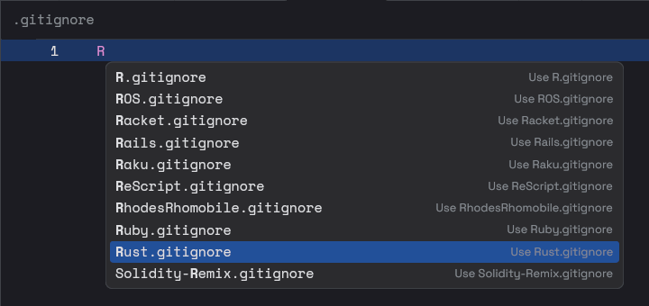

# Zed Extension for Gitignore Templates

A Zed extension that provides snippets of `.gitignore` templates from https://github.com/github/gitignore.

## Installation

Clone the repository and [install as a "dev" extension](https://zed.dev/docs/extensions/developing-extensions#developing-an-extension-locally).

## Contributions

For bug reports or feature requests, please open an issue on the GitHub repository.

## Credits

- [github/gitignore](https://github.com/github/gitignore) for the `.gitignore` templates.
